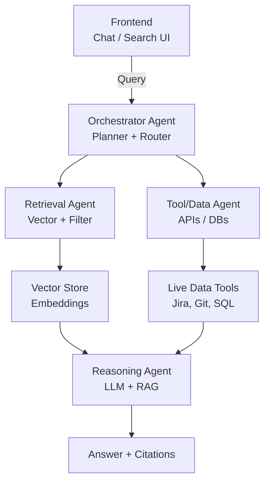

# AI Builders - Enterprise Intelligent Search MVP

A working Python prototype of an **enterprise-grade intelligent search system** that goes beyond keyword matching. It connects multiple data sources, builds a searchable knowledge base, and answers queries with contextual results and citations.

**Works offline with TF-IDF. Upgrades to OpenAI semantic search if API key is available.**

---

## What Problem Does This Solve?

This MVP demonstrates **agentic RAG** that:
- Connects multiple enterprise data sources
- Understands context and intent
- Provides grounded answers with citations
- Uses semantic search + optional LLM reasoning

---

## Architecture



---

## Tech Stack

| Component | Default (Offline) | With OpenAI |
|-----------|-------------------|-------------|
| **Search** | TF-IDF + Cosine Similarity | OpenAI Embeddings |
| **Answers** | Results only | GPT-4o generated |
| **UI** | Modern HTML/CSS/JS | Same |
| **Backend** | Python http.server | Same |

---

## Quickstart

### Basic (Works Offline)

```bash
cd enterprise-search-mvp
python3 mvp/server.py
```

Open http://127.0.0.1:8000

### With OpenAI (Semantic Search + GPT-4o Answers)

```bash
# Install optional dependencies
pip install openai httpx numpy

# Set your API key
export OPENAI_API_KEY="your-key-here"

# Run server
python3 mvp/server.py
```

The server auto-detects OpenAI and upgrades search quality.

---

## Features

### 1. Multi-Source Data Ingestion
- **CSV files**: Contracts, tickets, team directory (300+ records each)
- **Markdown docs**: Policies, runbooks, FAQs
- **Extensible**: Easy to add PDFs, APIs, databases

### 2. Smart Search
- **TF-IDF** (default): Works offline, no dependencies
- **OpenAI Embeddings** (optional): Semantic understanding
- **Intent Routing**: Automatically routes to relevant data sources

### 3. Intent Detection
| Query Pattern | Intent | Searches |
|--------------|--------|----------|
| `ACCT-1191` | exact_match | Contracts only |
| `Who is...` | people | Team directory |
| `ticket`, `issue` | tickets | Support tickets |
| Everything else | semantic | All sources |

### 4. Professional UI
- Formatted structured data (not raw CSV)
- Icons for data types (👤 People, 📄 Contracts, 🎫 Tickets)
- Match percentage scores
- GPT-4o answer toggle (when available)

### 5. Citations
Every result includes:
- Source name
- Data type badge
- Relevance score
- Formatted snippet

---

## Sample Queries

| Query | What It Does |
|-------|--------------|
| `SMB contracts` | Finds all SMB segment accounts |
| `ACCT-1191` | Exact match for specific account |
| `Support Director` | Finds people with this role |
| `Security team` | Searches team directory |
| `data retention` | Semantic search across all docs |

---

## Repository Structure

```
enterprise-search-mvp/
├── README.md
├── requirements.txt        # Optional dependencies
├── mvp/
│   ├── server.py          # Main server (TF-IDF + OpenAI)
│   ├── index.html         # Modern web UI
│   ├── style.css          # Styling
│   └── data/              # Sample enterprise data
│       ├── customer_contracts.csv   (300+ records)
│       ├── support_tickets.csv      (300+ records)
│       ├── team_directory.csv       (300+ records)
│       ├── employee_handbook.md
│       ├── engineering_runbook.md
│       ├── security_policies.md
│       ├── product_faq.md
│       └── ops_sop.md
└── diagram/
    └── architecture.mmd    # Mermaid diagram source
```

---

## How It Works

### 1. Data Loading
```python
# CSV files → Structured records with formatting
# Markdown files → Chunked documents
sources = load_sources()  # ~970 chunks total
```

### 2. Indexing
```python
# Always: TF-IDF index (works offline)
idf, vectors = build_tfidf_index(sources)

# Optional: OpenAI embeddings (if API available)
embeddings = build_embedding_index(sources)
```

### 3. Intent Routing
```python
def route_intent(query):
    if "ACCT-" in query:  → exact_match
    if "who" in query:    → people
    if "ticket" in query: → tickets
    else:                 → semantic
```

### 4. Search
```python
# Uses embeddings if available, falls back to TF-IDF
results = run_search(query, top_k=20)
```

### 5. Answer Generation (Optional)
```python
if use_llm and OPENAI_AVAILABLE:
    answer = generate_answer(query, results)  # GPT-4o
```

---

## Design Decisions

| Decision | Rationale |
|----------|-----------|
| **Offline-first** | Works without API keys or internet |
| **Graceful upgrade** | Auto-detects OpenAI, uses if available |
| **TF-IDF fallback** | Fast, effective for keyword search |
| **Intent routing** | Routes to relevant data sources |
| **Formatted display** | Professional UI, not raw data |

---

## Future Enhancements

| Feature | Status |
|---------|--------|
| RBAC & permissions | Planned |
| Live API integration (Jira, GitHub) | Planned |
| Multi-hop reasoning | Planned |
| Conversation memory | Planned |
| Streaming responses | Planned |

---

## Submission

This submission includes:
- ✅ Working prototype (runs offline)
- ✅ Multi-source ingestion (CSV + Markdown)
- ✅ Semantic search (TF-IDF + optional OpenAI)
- ✅ Context-aware intent routing
- ✅ Citations with source + relevance
- ✅ GPT-4o answers
- ✅ Professional modern UI
- ✅ Architecture diagram
