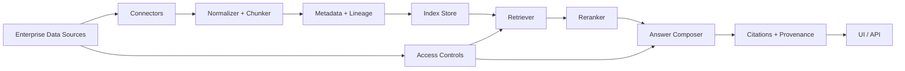

# ai-builders

AI Builders - Enterprise Intelligent Search MVP

This repo contains a minimal, working Python prototype of an enterprise search system
that connects multiple data sources, builds a local index, and answers queries
with contextual snippets and citations.

What is included
- A runnable MVP server (no external dependencies)
- Multi-source ingestion (Markdown + CSV)
- 300+ rows per CSV dataset for realistic volume
- Lightweight semantic-ish ranking (TF-IDF cosine)
- Citations with source + chunk IDs
- Modern UI with example queries
- Architecture diagram (Mermaid)

Architecture Diagram (Mermaid)

MVP Overview
The MVP uses a local index over files in `mvp/data/` and serves a small web UI
at `http://127.0.0.1:8000`. Search results include top matches with citations.

Quickstart (Python)
1) Run the server
   - `python3 mvp/server.py`
2) Open the UI
   - `http://127.0.0.1:8000`

Repository Structure
- `mvp/server.py` - HTTP server + indexing + search
- `mvp/index.html` - simple web UI
- `mvp/style.css` - basic styling
- `mvp/data/` - sample enterprise sources
- `diagram/architecture.mmd` - architecture diagram source

Sample Queries
- `incident response`
- `refunds`
- `data retention`
- `support director`

How it solves the problem
- Connecting data sources: file connectors simulate sources (docs + CSV).
- Context-aware agentic search: query is scored against chunks, metadata and
  provenance are preserved for grounding.
- Accurate citations: each answer returns the source file and chunk ID.
- Retrieval: TF-IDF cosine ranking for fast local retrieval.

Notes on Scoring
- The score shown in the UI is TF-IDF cosine similarity between the query and a
  chunk. It is a relative relevance score, not a percentage.

Assumptions
- This is a lightweight, local MVP. For production, replace the index with a
  vector database, add auth/ACL enforcement, and integrate enterprise sources.

Roadmap (Production)
- Source connectors: Google Drive, Confluence, Jira, Slack, Notion, GitHub
- Embeddings + vector DB: pgvector / Pinecone / Weaviate
- Reranking: cross-encoder or hybrid BM25 + embeddings
- Permissions: document- and chunk-level access control
- Governance: PII redaction, audit logs, retention policy
- Tooling: agentic planner + tool policy for multi-step retrieval

Submission Notes
This submission includes:
- A fully working local MVP (no external dependencies)
- Multi-source ingestion (Markdown + CSV)
- Contextual retrieval with provenance-preserving citations
- Architecture diagram illustrating production-ready design
- A short demo video showing the system end-to-end

Deployment Note
This MVP is intentionally designed to run locally to keep the focus on
agentic retrieval logic, indexing, and provenance. In a production setup,
the service would be containerized and deployed behind an API gateway,
with authentication, access controls, and a managed vector database.

Design Tradeoffs
- Local indexing was chosen over external databases to reduce setup
  complexity and highlight retrieval logic.
- TF-IDF cosine similarity provides fast, explainable relevance scoring
  suitable for an MVP.
- Access control is modeled architecturally but not enforced in the MVP,
  keeping the prototype focused and extensible.
